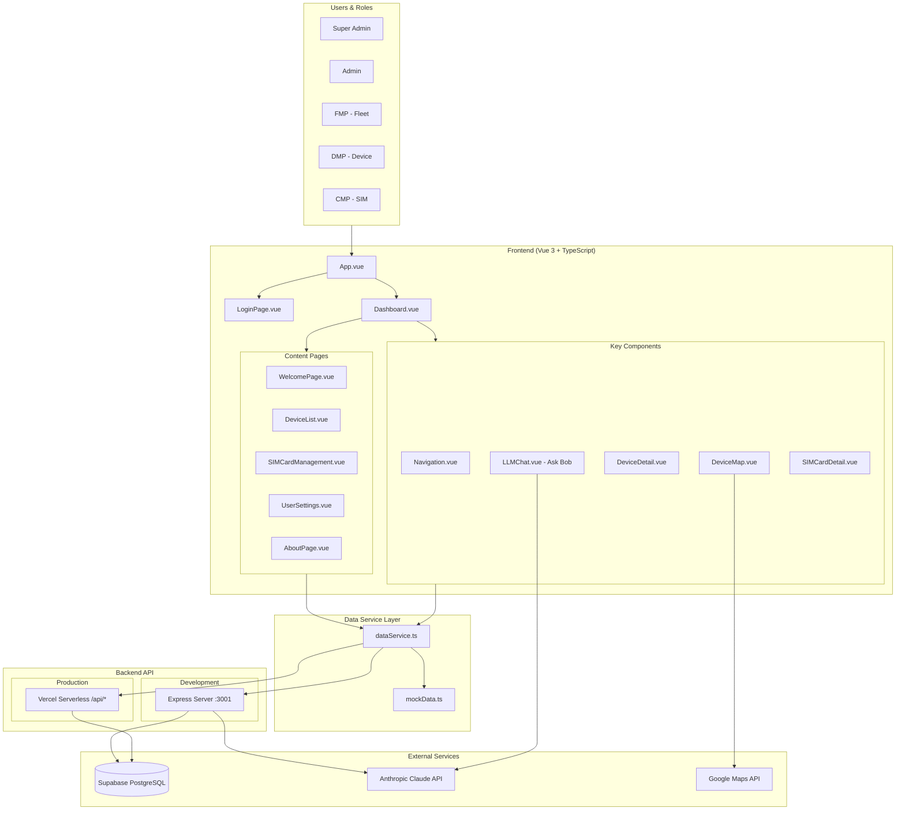

/exit# SIM Card Portal V3 - Architecture Diagram

## System Overview

```
┌─────────────────────────────────────────────────────────────────────────────────────────┐
│                                    SIM CARD PORTAL V3                                   │
│                              IoT Device & SIM Management Platform                       │
└─────────────────────────────────────────────────────────────────────────────────────────┘

┌─────────────────────────────────────────────────────────────────────────────────────────┐
│                                      USERS & ROLES                                      │
├─────────────────────────────────────────────────────────────────────────────────────────┤
│  ┌──────────────┐  ┌──────────────┐  ┌──────────────┐  ┌──────────────┐  ┌───────────┐ │
│  │ Super Admin  │  │    Admin     │  │     FMP      │  │     DMP      │  │    CMP    │ │
│  │  (Full Access│  │  (User Mgmt) │  │(Fleet Mgmt)  │  │(Device Mgmt) │  │(SIM Mgmt) │ │
│  └──────┬───────┘  └──────┬───────┘  └──────┬───────┘  └──────┬───────┘  └─────┬─────┘ │
│         │                 │                 │                 │                │       │
│         └─────────────────┴─────────────────┴─────────────────┴────────────────┘       │
└─────────────────────────────────────────────────────────────────────────────────────────┘
                                              │
                                              ▼
┌─────────────────────────────────────────────────────────────────────────────────────────┐
│                                 FRONTEND (Vue 3 + TypeScript)                           │
├─────────────────────────────────────────────────────────────────────────────────────────┤
│                                                                                         │
│  ┌────────────────────────────────────────────────────────────────────────────────────┐ │
│  │                              App.vue (Root Component)                              │ │
│  │                         Authentication State Management                            │ │
│  └────────────────────────────────────────────────────────────────────────────────────┘ │
│                          │                                    │                         │
│                          ▼                                    ▼                         │
│  ┌─────────────────────────────┐              ┌─────────────────────────────────────┐  │
│  │      LoginPage.vue          │              │         Dashboard.vue               │  │
│  │   • Form Authentication     │              │   • Navigation.vue (Sidebar)        │  │
│  │   • JWT Token Request       │              │   • LLMChat.vue (Ask Bob) *         │  │
│  │   • Session Management      │              │   • Content Pages                   │  │
│  └─────────────────────────────┘              └─────────────────────────────────────┘  │
│                                                              │                          │
│                    ┌─────────────────────────────────────────┼─────────────────────┐   │
│                    │                                         │                     │   │
│                    ▼                                         ▼                     ▼   │
│  ┌──────────────────────┐  ┌──────────────────────┐  ┌──────────────────────────────┐ │
│  │   WelcomePage.vue    │  │   DeviceList.vue     │  │   SIMCardManagement.vue      │ │
│  │   • KPI Dashboard    │  │   • Device Table     │  │   • SIM Card Table           │ │
│  │   • Quick Actions    │  │   • Search/Filter    │  │   • Usage Tracking           │ │
│  │   • System Stats     │  │   • Status Badges    │  │   • Carrier Management       │ │
│  └──────────────────────┘  └─────────┬────────────┘  └──────────────────────────────┘ │
│                                      │                                                 │
│                    ┌─────────────────┼─────────────────┐                               │
│                    ▼                 ▼                 ▼                               │
│  ┌──────────────────────┐ ┌───────────────────┐ ┌─────────────────────┐               │
│  │  DeviceDetail.vue    │ │  DeviceMap.vue    │ │ SIMCardDetail.vue   │               │
│  │  • Full Device Info  │ │  • Google Maps    │ │ • SIM Details       │               │
│  │  • Sensor Charts     │ │  • Fleet View     │ │ • Usage History     │               │
│  │  • Location History  │ │  • Markers        │ │ • Status Changes    │               │
│  └──────────────────────┘ └───────────────────┘ └─────────────────────┘               │
│                                                                                         │
│  ┌──────────────────────┐  ┌──────────────────────┐  ┌──────────────────────────────┐ │
│  │  UserSettings.vue    │  │   AboutPage.vue      │  │      LLMChat.vue             │ │
│  │  • User Management   │  │   • Company Info     │  │   • AI Assistant "Ask Bob"  │ │
│  │  • API Key Config    │  │   • Documentation    │  │   • Action Proposals        │ │
│  │  • LLM Toggle *      │  │   • Contact Info     │  │   • CSV Export              │ │
│  └──────────────────────┘  └──────────────────────┘  └──────────────────────────────┘ │
│                                                                                         │
│  * LLM Toggle: Super Admin can enable/disable Ask Bob for all users                    │
│                                                                                         │
├─────────────────────────────────────────────────────────────────────────────────────────┤
│  UI Framework: PrimeVue 4.3  │  Styling: Tailwind CSS 4  │  Maps: Google Maps/Leaflet │
│  Charts: Chart.js 4.5        │  Build: Vite 7.0          │  State: Vue 3 Reactivity   │
└─────────────────────────────────────────────────────────────────────────────────────────┘
                                              │
                                              ▼
┌─────────────────────────────────────────────────────────────────────────────────────────┐
│                                    DATA SERVICE LAYER                                   │
├─────────────────────────────────────────────────────────────────────────────────────────┤
│                                                                                         │
│  ┌─────────────────────────────────────────────────────────────────────────────────┐   │
│  │                          dataService.ts (Singleton)                              │   │
│  ├─────────────────────────────────────────────────────────────────────────────────┤   │
│  │  getDevices()      │  getSIMCards()     │  createDevice()    │  updateDevice()  │   │
│  │  deleteDevice()    │  deleteSIMCard()   │  sendLLMMessage()  │  executeLLMAction│   │
│  └─────────────────────────────────────────────────────────────────────────────────┘   │
│                          │                              │                               │
│                          ▼                              ▼                               │
│  ┌─────────────────────────────┐          ┌─────────────────────────────┐              │
│  │      mockData.ts            │          │       API Endpoints         │              │
│  │   (Development Fallback)    │          │    (Production Mode)        │              │
│  └─────────────────────────────┘          └─────────────────────────────┘              │
│                                                                                         │
└─────────────────────────────────────────────────────────────────────────────────────────┘
                                              │
                                              ▼
┌─────────────────────────────────────────────────────────────────────────────────────────┐
│                                    BACKEND API LAYER                                    │
├──────────────────────────────────────┬──────────────────────────────────────────────────┤
│        DEVELOPMENT (Express)         │           PRODUCTION (Vercel Serverless)        │
├──────────────────────────────────────┼──────────────────────────────────────────────────┤
│                                      │                                                  │
│  local-api-server.js                 │   /api/*.ts (Vercel Functions)                  │
│  Port: 3001                          │   Auto-deployed from main branch                │
│                                      │                                                  │
│  ┌────────────────────────────────┐  │  ┌────────────────────────────────────────────┐ │
│  │      API ENDPOINTS             │  │  │           API ENDPOINTS                    │ │
│  ├────────────────────────────────┤  │  ├────────────────────────────────────────────┤ │
│  │                                │  │  │                                            │ │
│  │  POST /api/auth                │  │  │  /api/auth.ts                              │ │
│  │    └─ Login, Token Verify      │  │  │    └─ JWT Authentication                   │ │
│  │                                │  │  │                                            │ │
│  │  GET/POST/PUT/DELETE           │  │  │  /api/devices.ts                           │ │
│  │    /api/devices                │  │  │    └─ Device CRUD                          │ │
│  │                                │  │  │                                            │ │
│  │  GET/POST/PUT/DELETE           │  │  │  /api/simcards.ts                          │ │
│  │    /api/simcards               │  │  │    └─ SIM Card CRUD                        │ │
│  │                                │  │  │                                            │ │
│  │  GET /api/device-location-     │  │  │  /api/device-location-history.ts           │ │
│  │       history                  │  │  │    └─ GPS Tracking Data                    │ │
│  │                                │  │  │                                            │ │
│  │  GET /api/device-sensor-       │  │  │  /api/device-sensor-history.ts             │ │
│  │       history                  │  │  │    └─ Sensor Telemetry                     │ │
│  │                                │  │  │                                            │ │
│  │  POST /api/llm/chat            │  │  │  /api/device-types.ts                      │ │
│  │  POST /api/llm/execute         │  │  │  /api/locations.ts                         │ │
│  │                                │  │  │                                            │ │
│  └────────────────────────────────┘  │  └────────────────────────────────────────────┘ │
│                                      │                                                  │
└──────────────────────────────────────┴──────────────────────────────────────────────────┘
                                              │
                          ┌───────────────────┼───────────────────┐
                          ▼                   ▼                   ▼
┌─────────────────────────────┐ ┌─────────────────────────┐ ┌─────────────────────────────┐
│      SUPABASE (PostgreSQL)  │ │   ANTHROPIC CLAUDE API  │ │    GOOGLE MAPS API          │
├─────────────────────────────┤ ├─────────────────────────┤ ├─────────────────────────────┤
│                             │ │                         │ │                             │
│  ┌───────────────────────┐  │ │  Model: Claude 3        │ │  • Maps JavaScript API      │
│  │      TABLES           │  │ │                         │ │  • Marker Clustering        │
│  ├───────────────────────┤  │ │  Features:              │ │  • Custom Map Styling       │
│  │  • devices            │  │ │  • Natural Language     │ │  • Geocoding                │
│  │  • sim_cards          │  │ │    Queries              │ │                             │
│  │  • users              │  │ │  • Action Proposals     │ │  Env Variables:             │
│  │  • user_sessions      │  │ │  • Context-Aware        │ │  • VITE_GOOGLE_MAPS_API_KEY │
│  │  • device_types       │  │ │    Responses            │ │  • VITE_GOOGLE_MAPS_MAP_ID  │
│  │  • locations          │  │ │                         │ │                             │
│  │  • device_location_   │  │ │  Env Variable:          │ └─────────────────────────────┘
│  │    history            │  │ │  • ANTHROPIC_API_KEY    │
│  │  • device_sensor_     │  │ │                         │
│  │    history            │  │ │  Integration:           │
│  │  • pending_actions    │  │ │  • @anthropic-ai/sdk    │
│  │  • llm_audit_log      │  │ │    v0.71.2              │
│  └───────────────────────┘  │ │                         │
│                             │ └─────────────────────────┘
│  Env Variables:             │
│  • SUPABASE_URL             │
│  • SUPABASE_SERVICE_ROLE_KEY│
│                             │
└─────────────────────────────┘


┌─────────────────────────────────────────────────────────────────────────────────────────┐
│                                   DEPLOYMENT ARCHITECTURE                               │
├─────────────────────────────────────────────────────────────────────────────────────────┤
│                                                                                         │
│   DEVELOPMENT                              PRODUCTION                                   │
│   ───────────                              ──────────                                   │
│                                                                                         │
│   ┌─────────────────────┐                  ┌─────────────────────────────────────────┐ │
│   │   Docker Compose    │                  │              VERCEL                     │ │
│   ├─────────────────────┤                  ├─────────────────────────────────────────┤ │
│   │                     │                  │                                         │ │
│   │  ┌───────────────┐  │                  │  ┌─────────────┐   ┌─────────────────┐  │ │
│   │  │  PostgreSQL   │  │                  │  │   Static    │   │   Serverless    │  │ │
│   │  │  Port: 5434   │  │                  │  │   Frontend  │   │   Functions     │  │ │
│   │  └───────────────┘  │                  │  │  (dist/)    │   │   (/api/*.ts)   │  │ │
│   │                     │                  │  └─────────────┘   └─────────────────┘  │ │
│   │  ┌───────────────┐  │                  │                                         │ │
│   │  │  Express API  │  │                  │  Auto-deploy from main branch           │ │
│   │  │  Port: 3001   │  │                  │  CI/CD Pipeline                         │ │
│   │  └───────────────┘  │                  │                                         │ │
│   │                     │                  └─────────────────────────────────────────┘ │
│   │  ┌───────────────┐  │                                                              │
│   │  │  Vite Dev     │  │                                                              │
│   │  │  Port: 5173   │  │                                                              │
│   │  └───────────────┘  │                                                              │
│   │                     │                                                              │
│   └─────────────────────┘                                                              │
│                                                                                         │
└─────────────────────────────────────────────────────────────────────────────────────────┘


┌─────────────────────────────────────────────────────────────────────────────────────────┐
│                                   AUTHENTICATION FLOW                                   │
├─────────────────────────────────────────────────────────────────────────────────────────┤
│                                                                                         │
│   ┌──────────┐    ┌──────────────┐    ┌─────────────┐    ┌────────────────────────┐   │
│   │  User    │───▶│ LoginPage    │───▶│  Validate   │───▶│  Store in localStorage │   │
│   │  Input   │    │  .vue        │    │  Credentials│    │  • sim-portal-auth     │   │
│   └──────────┘    └──────────────┘    └─────────────┘    │  • sim-portal-user     │   │
│                                              │           └────────────────────────┘   │
│                                              ▼                        │               │
│                                    ┌─────────────────┐                ▼               │
│                                    │  POST /api/auth │       ┌────────────────┐       │
│                                    │  (JWT Token)    │       │   Dashboard    │       │
│                                    └─────────────────┘       │   Rendered     │       │
│                                              │               └────────────────┘       │
│                                              ▼                                        │
│                                    ┌─────────────────┐                                │
│                                    │  Supabase       │                                │
│                                    │  user_sessions  │                                │
│                                    └─────────────────┘                                │
│                                                                                         │
│   User Roles: Super Admin │ Admin │ FMP │ DMP │ CMP │ Viewer (+ Portal Variants)      │
│                                                                                         │
└─────────────────────────────────────────────────────────────────────────────────────────┘


┌─────────────────────────────────────────────────────────────────────────────────────────┐
│                              LLM (ASK BOB) INTEGRATION FLOW                             │
├─────────────────────────────────────────────────────────────────────────────────────────┤
│                                                                                         │
│   ┌──────────┐    ┌──────────────┐    ┌─────────────┐    ┌────────────────────────┐   │
│   │  User    │───▶│  LLMChat     │───▶│ POST        │───▶│   Anthropic Claude     │   │
│   │  Message │    │  .vue        │    │ /api/llm/   │    │   API (Claude 3)       │   │
│   └──────────┘    └──────────────┘    │ chat        │    └────────────────────────┘   │
│                                       └─────────────┘               │                 │
│                                                                     ▼                 │
│   ┌────────────────────────────────────────────────────────────────────────────────┐  │
│   │                              CLAUDE RESPONSE                                   │  │
│   ├────────────────────────────────────────────────────────────────────────────────┤  │
│   │  • Natural Language Answer                                                      │  │
│   │  • Proposed Actions (create/update/delete device or SIM)                       │  │
│   └────────────────────────────────────────────────────────────────────────────────┘  │
│                                              │                                        │
│                              ┌───────────────┴───────────────┐                        │
│                              ▼                               ▼                        │
│                    ┌─────────────────┐             ┌─────────────────┐                │
│                    │  User Approves  │             │  User Rejects   │                │
│                    │  Action         │             │  Action         │                │
│                    └────────┬────────┘             └─────────────────┘                │
│                             │                                                         │
│                             ▼                                                         │
│                    ┌─────────────────┐                                                │
│                    │ POST /api/llm/  │                                                │
│                    │ execute         │                                                │
│                    └────────┬────────┘                                                │
│                             │                                                         │
│                             ▼                                                         │
│                    ┌─────────────────┐    ┌─────────────────┐                         │
│                    │  Execute on DB  │───▶│  llm_audit_log  │                         │
│                    │  (devices/sims) │    │  (Audit Trail)  │                         │
│                    └─────────────────┘    └─────────────────┘                         │
│                                                                                         │
│   * LLM can be enabled/disabled globally by Super Admin in Settings                    │
│                                                                                         │
└─────────────────────────────────────────────────────────────────────────────────────────┘
```

## Mermaid Diagram (for rendering in compatible tools)



## Technology Stack Summary

| Layer | Technologies |
|-------|-------------|
| **Frontend** | Vue 3, TypeScript, Vite 7, PrimeVue 4.3, Tailwind CSS 4 |
| **Maps & Charts** | Google Maps API, Leaflet, Chart.js 4.5 |
| **Backend (Dev)** | Node.js, Express |
| **Backend (Prod)** | Vercel Serverless Functions |
| **Database** | Supabase (PostgreSQL) |
| **AI/LLM** | Anthropic Claude 3 (@anthropic-ai/sdk) |
| **Authentication** | JWT Tokens, localStorage |

## Key Features

- **Multi-role Authentication**: Super Admin, Admin, FMP, DMP, CMP with granular permissions
- **Device Management**: CRUD operations, real-time status, location tracking, sensor history
- **SIM Card Management**: Inventory, usage tracking, carrier management, lifecycle control
- **Fleet Visualization**: Google Maps integration with marker clustering
- **AI Assistant (Ask Bob)**: Natural language queries, action proposals with approval workflow
- **LLM Control**: Super Admin can enable/disable AI features globally
- **Audit Logging**: Complete trail of LLM interactions and system changes
