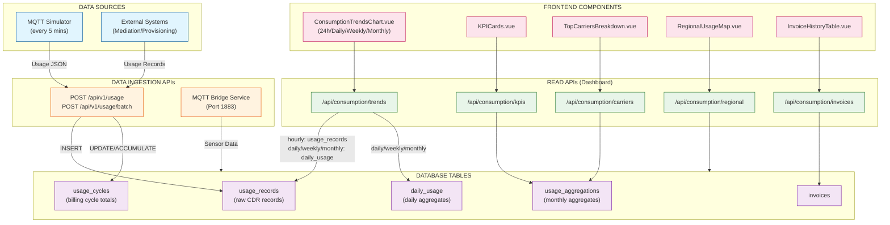

# Consumption Data Flow Diagram

## Overview

This document shows how consumption/usage data flows through the SIM Card Portal system.

## Data Flow Diagram



## Current Data Flow Status

### WRITE PATH (Working)
```
MQTT Simulator (every 5 mins)
    ↓
POST /api/v1/usage
    ↓
usage_records table ✅ (88 records today, ~1.2GB)
    ↓
usage_cycles table ✅ (accumulated totals)
```

### READ PATH for 24hr View (Fixed)
```
ConsumptionTrendsChart.vue (24h mode)
    ↓
GET /api/consumption/trends?granularity=hourly
    ↓
Docker API queries: usage_records ✅
    ↓
Groups by hour using date_trunc('hour', period_start)
    ↓
Returns actual MQTT data per hour
```

### READ PATH for Daily/Weekly/Monthly (Uses Seeded Data)
```
ConsumptionTrendsChart.vue (daily/weekly/monthly mode)
    ↓
GET /api/consumption/trends?granularity=daily|weekly|monthly
    ↓
Docker API queries: daily_usage table
    ↓
Returns seeded sample data (not real MQTT data)
```

## Table Details

| Table | Purpose | Data Source | Used By |
|-------|---------|-------------|---------|
| `usage_records` | Raw usage records from MQTT | POST /api/v1/usage | 24hr trends chart |
| `usage_cycles` | Accumulated per-SIM billing totals | Auto-updated on usage submit | KPIs (partially) |
| `daily_usage` | Daily aggregated data | Seeded sample data | Daily/Weekly/Monthly charts |
| `usage_aggregations` | Monthly carrier aggregates | Seeded sample data | KPIs, Carriers chart |
| `invoices` | Billing records | Manual/seeded | Invoice table |

## Gap Identified

**Problem**: Real-time MQTT data goes to `usage_records` but the `daily_usage` table is not automatically populated from it.

**Current Workaround**:
- 24hr view now queries `usage_records` directly (fixed)
- Daily/Weekly/Monthly views use seeded sample data in `daily_usage`

**Recommended Fix**: Create a scheduled job or trigger to aggregate `usage_records` into `daily_usage` daily.
